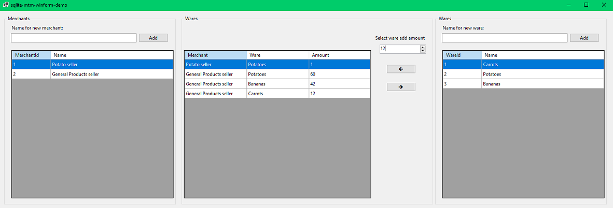



## About The Project

This is just a simple demo about a SQLite database with many-to-many(M-T-M) table that has and additional row `amount` using Windows Forms.

### Windows Forms GUI



## Built With

* [Visual Studio 2022](https://visualstudio.microsoft.com/vs/)
* [.NET 6.0 Windows Forms](https://docs.microsoft.com/en-us/dotnet/api/system.windows.forms?view=windowsdesktop-6.0)
* [Entity Framework Core](https://docs.microsoft.com/en-us/ef/core/)

##### Nuget packages

* [Microsoft.EntityFrameworkCore.Sqlite (6.0.3)](https://www.nuget.org/packages/Microsoft.EntityFrameworkCore.Sqlite/6.0.3?_src=template)
* [Microsoft.EntityFrameworkCore.Proxies (6.0.3)](https://www.nuget.org/packages/Microsoft.EntityFrameworkCore.Proxies/6.0.3?_src=template)

## Roadmap & Contributing

Curretly there are no plans for future updates.

## License

Distributed under the MIT Licence where applicable. See `LICENSE.txt` for more information.

(<a href="#top">back to top</a>)

